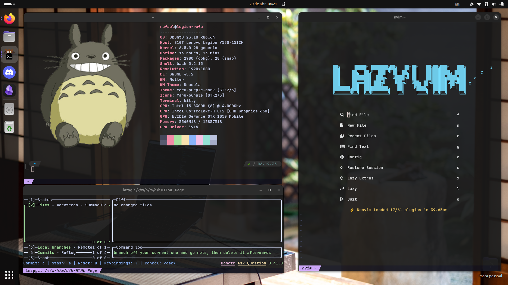

# Rafael Tenorio dotfiles

**Warning**: Don’t blindly use my settings unless you know what that entails. Use at your own risk!

### Looking for some aesthetic motivation for study?

Check out my Software Engineer Study Blog on [tumblr](https://heart-ghost-studyblr.tumblr.com/)
 

## Contents

- Vim (Neovim) config
- Tmux config
- Git config
- Fish config

  

## Neovim setup

### Requirements

- Neovim >= **0.9.0** (needs to be built with **LuaJIT**)
- Git >= **2.19.0** (for partial clones support)
- [LazyVim](https://www.lazyvim.org/)
- a [Nerd Font](https://www.nerdfonts.com/)(v3.0 or greater) **_(optional, but needed to display some icons)_**
- [lazygit](https://github.com/jesseduffield/lazygit) **_(optional)_**
- a **C** compiler for `nvim-treesitter`. See [here](https://github.com/nvim-treesitter/nvim-treesitter#requirements)
- for [telescope.nvim](https://github.com/nvim-telescope/telescope.nvim) **_(optional)_**
  - **live grep**: [ripgrep](https://github.com/BurntSushi/ripgrep)
  - **find files**: [fd](https://github.com/sharkdp/fd)
- a terminal that support true color and _undercurl_:

  - [kitty](https://github.com/kovidgoyal/kitty) **_(Linux & Macos)_**
  - [wezterm](https://github.com/wez/wezterm) **_(Linux, Macos & Windows)_**
  - [alacritty](https://github.com/alacritty/alacritty) **_(Linux, Macos & Windows)_**
  - [iterm2](https://iterm2.com/) **_(Macos)_**
  - [Sainhee Sonoka Andromeda](https://github.com/sainnhe/sonokai)

## Shell setup (macOS & Linux)

- [Fish shell](https://fishshell.com/)

- [Fisher](https://github.com/jorgebucaran/fisher) - Plugin manager
- [Tide](https://github.com/IlanCosman/tide) - Shell theme
- [Nerd fonts](https://github.com/ryanoasis/nerd-fonts) - Patched fonts for development-use. I use [PlemolJP](https://github.com/yuru7/PlemolJP) and BlexMono.
- [z for fish](https://github.com/jethrokuan/z) - Directory jumping
- [Eza](https://github.com/eza-community/eza) - `ls` replacement
- [ghq](https://github.com/x-motemen/ghq) - Local Git repository organizer
- [fzf](https://github.com/PatrickF1/fzf.fish) - Interactive filtering

## About me

- [Visit all my links here](https://rafaeltenorio-links.fly.dev)
- Check out my [Software Engineer Study Blog](https://heart-ghost-studyblr.tumblr.com/)
